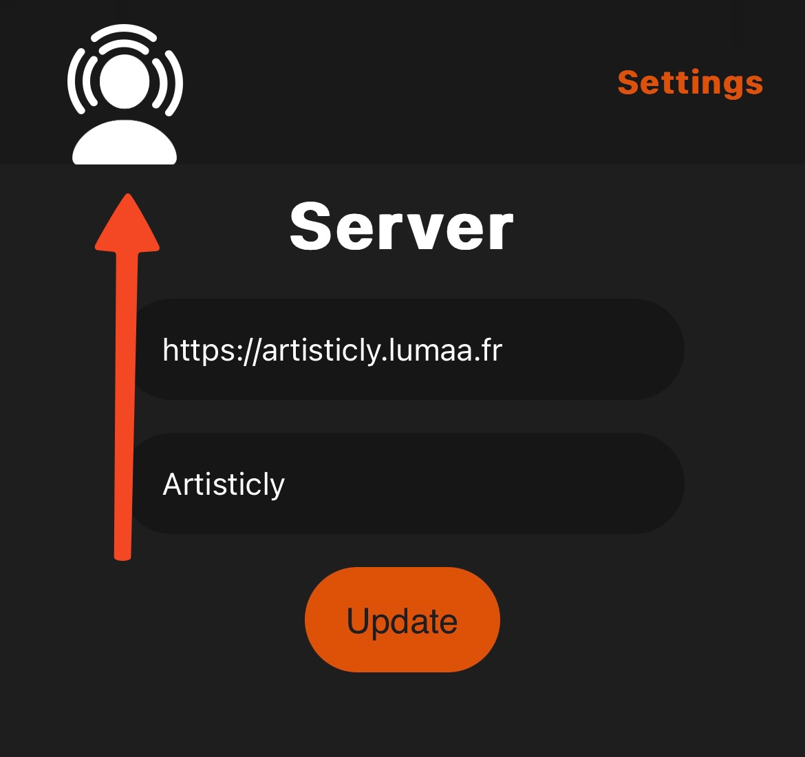
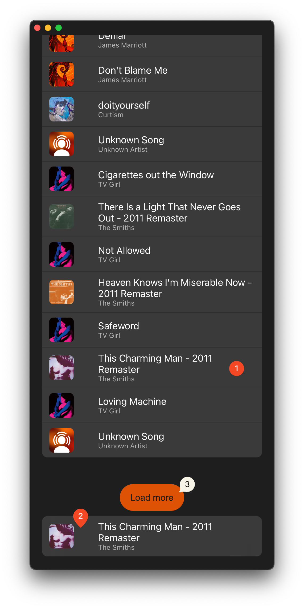

# Artisticly Web

\
Discover anyone's [Artisticly library](https://github.com/lumaa-dev/ArtisticlyServer) via the web, on your phone or on a computer.

## How it works
When you first arrive on the website, you will be directly redirect to `/settings` with a server URL and an access code. Once entered, press **Update**.

If the entered server is an online [Artisticly server](https://github.com/lumaa-dev/ArtisticlyServer), the button should say **Updated**. Now you can tap/click back on the Artisticly logo in the top left, and the song library should appear!\


There is also an alternative way of doing so, that is quicker and used by the [default Artisticly app](https://apps.lumaa.fr/app/artisticly), that is to send the root URL with the query `url`, that would be like so: `https://example.com/?url=https://artisticly.example.com/`, and if needed, there is also a `code` query to provide anyone a default access code.\
If the URL isn't an Artisticly server, users will be redirected in the `/settings` page.

## Library
After loading the library, you will see all 20 first songs of your library, the private ones included if the access code is correct. Tap or click on a song to start/pause it *(1)*, this also works in the *Now Playing* ornament at the bottom of the screen *(2)*. If ***the*** perfect song is not in the 20 firsts, then scroll at the very bottom and tap **Load more** *(3)*, and 20 additional songs from your library will be added!\


## Sharing a music
You can share an individual music by doing the same as before, using the `url` and optional `code` queries, but using the path `/music/[song id]`. Adding these two would end up like so: `https://example.com/music/12?url=https://artisticly.example.com/`. Users will be required to tap anywhere on the screen to start playing the song with the matching identifier.

## Vue.JS instructions
### Project setup
```bash
npm install
```

#### Compiles and hot-reloads for development
```bash
npm run serve
```

#### Compiles and minifies for production
```bash
npm run build
```